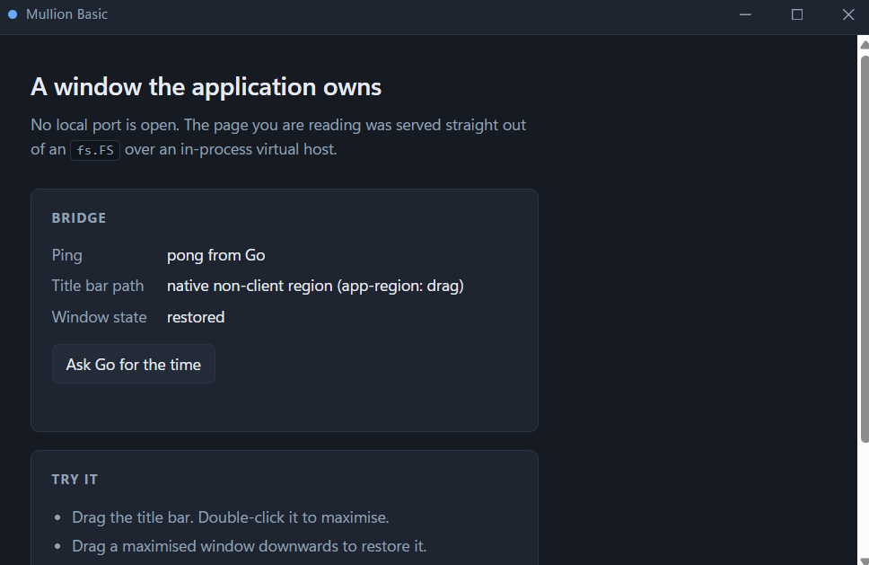

# mullion

A Win32 window host for WebView2, in pure Go. No CGo. No local port.

`mullion` creates the window, embeds WebView2 in it, and hands the frame to your
frontend: your HTML draws the title bar, and the window procedure still does the
things a native caption does — drag, double-click to maximise, resize edges,
snap, the system menu, per-monitor DPI. Assets are served to the WebView straight
out of an `fs.FS` over an in-process virtual host, so nothing listens on a socket
and there is no HTTP server to firewall.



```go
//go:embed all:frontend
var embedded embed.FS

func main() {
	assets, _ := fs.Sub(embedded, "frontend")

	host := mullion.New(mullion.Config{
		Assets: assets,
		Title:  "Demo",
		Width:  980,
		Height: 640,
	})

	if err := host.Run(); err != nil {
		log.Fatal(err)
	}
}
```

That is a complete application. `Config.Bridge` is optional: window controls are
answered by the host itself, so the title bar works before you have written a
single Go method.

```
go get github.com/Burakuslendera/mullion
```

Requires Windows and the [WebView2 Runtime][runtime] (shipped with Windows 11 and
current Windows 10). Non-Windows builds compile — `Run` returns
`ErrUnsupportedPlatform` — so a cross-platform program does not need build tags to
depend on this package.

[runtime]: https://developer.microsoft.com/microsoft-edge/webview2/

## Why

Embedding WebView2 is easy. Embedding it in a window whose title bar you drew
yourself, without losing what the shell gives a real window, is not. The failure
modes are quiet: the window compiles, opens, renders — and the drag band is four
pixels off, or the maximise animation is gone, or the content collapses to a
sliver after a style change, or everything is subtly blurry on a 150% monitor.

This package is the result of chasing each of those to its root cause. The code
is one half of it; [`docs/`](docs/) is the other.

## What you get

- **A frame you own.** Custom title bar, caption buttons, eight resize zones,
  system menu, snap. `WM_NCCALCSIZE`, `WM_NCHITTEST`, `WM_GETMINMAXINFO` and
  `WM_DPICHANGED` are handled; you write CSS.
- **Non-client region support** where the runtime has it (WebView2 131+), so CSS
  `app-region: drag` produces a real `HTCAPTION` and the shell handles dragging.
  Older runtimes fall back to an injected JavaScript drag path automatically.
- **No port.** Assets come from `fs.FS` via `WebResourceRequested` and an
  `IStream`. Scheme, host and path traversal are all rejected at the boundary.
- **A bridge that already works.** `window.mullion.invoke("Method", ...args)`
  returns a `Promise`; window controls are reserved and never reach your code.
- **Diagnostics that answer the real question.** A render watchdog fires if the
  frontend never paints, and reports whether the document arrived, whether its
  stylesheets and scripts arrived, and what the last bridge call was.
- **Pure Go, and its own WebView2 layer.** The runtime is located, loaded and
  driven from `internal/webview2`: the COM interfaces, the event handlers and the
  environment bootstrap are all written here, against Microsoft's published
  interface definitions. There is no C toolchain, no bundled loader DLL, and no
  third-party browser binding to keep in step with. The only dependency in
  `go.mod` is `golang.org/x/sys`.

## The frame contract

Three `Config` values must match your CSS. The native hit test is computed from
them; the visible title bar is drawn from the CSS. If they disagree, the two
drift apart and part of your title bar stops dragging.

| `Config`               | Default | CSS                                     |
| ---------------------- | ------- | --------------------------------------- |
| `TitlebarHeight`       | 36      | height of your title bar element        |
| `CaptionControlsWidth` | 138     | total width of the caption button group |
| `ResizeBorder`         | 8       | nothing — handled natively              |

See [`examples/basic`](examples/basic) for a working frontend: a title bar with
`app-region: drag`, three caption buttons that opt out with `app-region: no-drag`,
and a bridge round-trip printed into the page.

## Things this cost weeks to learn

The full versions, with symptoms and fixes, are in [`docs/`](docs/). The short
list, because it is the reason this repository exists:

- **Do not clear `WS_CAPTION` and `WS_SYSMENU`.** It is the obvious way to remove
  the title bar and it is wrong: without those bits DWM stops treating the window
  as having a caption, and the shell's minimise/maximise/restore *animations*
  disappear. Keep the bits; take the client area with `WM_NCCALCSIZE` instead.

- **`SetWindowPos(..., SWP_FRAMECHANGED)` must keep `SWP_NOMOVE|SWP_NOSIZE`.**
  `SetWindowPos` reads the position and size arguments unless told not to.
  Passing zeros without those flags does not mean "leave it alone", it means
  "move to 0,0 and resize to nothing" — the client rect collapses to a few dozen
  pixels and the WebView renders into a sliver.

- **`WM_NCCALCSIZE` must preserve the client area for *every* `wParam`.** Handling
  only the `TRUE` case leaves a frame that is correct until the first message
  that arrives with `FALSE`.

- **Enable WebView2's non-client region between `Embed` and the first
  `Navigate`.** Later, and you get a reload flash or a two-navigation startup.

- **Derive a COM vtable from the SDK header, never from the reference docs.**
  Microsoft's reference pages list members alphabetically; the vtable is in
  declaration order. Get one slot wrong and you do not get an error, you get a
  crash inside a live COM call. Three that bite: `IsPinchZoomEnabled` is on
  `Settings5`, not `Settings6`; `IsVisible` precedes `Bounds` on the controller;
  and `get_Headers` sits *between* `Content` and `StatusCode` on a web resource
  response.

- **Feature-detect with `QueryInterface`, not with a version number.** The
  WebView2 SDK loader is where the minimum-version gate lives — talk to the
  runtime directly and the gate is gone, so a version check proves nothing.
  Asking the object whether it implements an interface proves everything, and an
  old runtime answers with a clean `E_NOINTERFACE` rather than a crash.

- **A Go panic must never escape a COM event handler.** If it unwinds into a
  Chromium frame the process dies. Recover, and return `S_OK` — a failing
  HRESULT out of `WebResourceRequested` is read as "no response produced", which
  blanks the asset and turns one Go bug into a dead window.

- **`app-region: drag` gives you Caption, never Maximize.** It produces
  `HTCAPTION` (drag, double-click, system menu). There is no CSS that makes an
  HTML element report `HTMAXBUTTON`, so the Windows 11 snap flyout on maximise-
  button hover cannot be had from a client-extended WebView2 window. Snap by
  keyboard and by drag-to-edge still work. See
  [`docs/snap-and-nonclient-region.md`](docs/snap-and-nonclient-region.md); this
  one is widely misunderstood.

- **Set `PER_MONITOR_AWARE_V2` before the process owns any `HWND`** — including
  hidden helper windows created by other libraries — and before any WebView2
  child exists. An unaware process renders everything at the wrong scale, and the
  symptom looks like a font problem, so people go and edit CSS.

- **On `WM_DPICHANGED`, apply the rect Windows suggests, and nothing else.**
  Scaling it again yourself compounds: 96 → 120 → 96 no longer round-trips.

- **Restore flicker is `WM_ERASEBKGND`.** Left to `DefWindowProc`, Windows paints
  the background brush over the client area before the WebView redraws at the new
  size, and you get one frame of empty background. Return 1.

- **The resize border belongs to `WM_NCHITTEST`, not to CSS.** 8 logical pixels,
  scaled by the *window's* DPI. And turn Chromium's user zoom off
  (`IsZoomControlEnabled`, `IsPinchZoomEnabled`): a zoom scales your CSS bar
  without moving the native band it is supposed to sit on.

- **The system menu needs an explicit `EnableMenuItem` sync.** `DefWindowProc`
  does not update item state on `WM_INITMENU`, so a maximised window will happily
  offer you "Maximize".

- **Do not measure the WebView by picking the largest child HWND.** Chromium's
  intermediate compositing window reports a stale rect after a programmatic
  resize; measure the `Chrome_WidgetWin*` controller child or your verification
  script will fail a window that is fine.

- **Injected mouse input never reaches the WebView2 child.** `mouse_event` and
  `SetCursorPos` can drive the native frame (title bar, resize edges — those are
  the parent HWND), but they cannot click a button inside your page. Plan your
  automated checks accordingly.

## Documentation

| Document                                                             | What it covers                                                                   |
| -------------------------------------------------------------------- | -------------------------------------------------------------------------------- |
| [architecture.md](docs/architecture.md)                               | Bootstrap order, threading model, asset serving without a port, the bridge        |
| [frame-and-dpi.md](docs/frame-and-dpi.md)                             | `WM_NCCALCSIZE`, hit testing, per-monitor DPI, restore flicker                    |
| [snap-and-nonclient-region.md](docs/snap-and-nonclient-region.md)     | What WebView2 can and cannot do with Windows 11 snap, and the COM binding for it  |
| [snap-sources.md](docs/snap-sources.md)                               | The 40 primary and secondary sources those findings rest on                       |
| [lessons-and-dead-ends.md](docs/lessons-and-dead-ends.md)             | Approaches that were tried and abandoned, and why                                 |
| [verification.md](docs/verification.md)                               | How to check a change actually works — "it compiles" is not acceptance            |

## Configuration

Everything below has a working default; `Config{Assets: assets}` is complete.

```go
type Config struct {
	Assets fs.FS            // required: must contain index.html

	Title       string      // "Mullion"
	ClassName   string      // "MullionWindow"
	VirtualHost string      // "mullion.local" -> https://mullion.local
	JSNamespace string      // "mullion"       -> window.mullion, data-mullion-*

	Width, Height int32     // 1024 x 768
	StartHidden   bool

	TitlebarHeight       int32 // 36  } must match your CSS
	CaptionControlsWidth int32 // 138 }
	ResizeBorder         int32 // 8

	HitTestTitlebarHeight       int32 // escape hatch: native band != CSS band
	HitTestCaptionControlsWidth int32

	DragSelector     string  // "[data-mullion-drag]" (fallback drag path)
	BackgroundColour Colour  // painted before the first frame
	DevTools         bool    // keep F12 / context menu / accelerators

	ShowTimeout   time.Duration // 7s;  wait for shellReady() before showing
	RenderTimeout time.Duration // 16s; watchdog if the frontend never paints

	Logger Logger                 // default: discard
	Bridge func(string) string    // optional: your methods only
	OnReady func()
	OnClose func() bool           // return true to cancel the close
}
```

`Logger` takes pre-sanitised single strings — file system paths are reduced to
their base name before they reach you, so messages can be forwarded verbatim
without leaking user paths. `SlogLogger(*slog.Logger)` is provided.

## Frontend API

`window.mullion` is injected before your scripts run. There is nothing to import
and no generated binding file to keep in sync.

```js
await mullion.invoke("Method", ...args);   // -> your Config.Bridge

mullion.window.minimise();
mullion.window.toggleMaximise();
mullion.window.close();
await mullion.window.isMaximised();
mullion.window.startDrag();                // only needed for a custom drag path
mullion.window.startResize("top-left");

mullion.shellReady();   // releases the startup gate; the window appears
mullion.ready();        // stops the render watchdog; call after the first paint

mullion.tabTitlebar;    // true when the native non-client region path is active
```

## Diagnostics

```
go run github.com/Burakuslendera/mullion/cmd/mullion@latest doctor
```

That is the whole command — nothing is installed, and `go run` fetches, builds
and runs it in one step. To keep it, install it instead:

```
go install github.com/Burakuslendera/mullion/cmd/mullion@latest
mullion doctor
```

`go install` puts the binary in `$(go env GOPATH)/bin`. **That directory has to
be on your `PATH`** or the bare `mullion doctor` will not be found — Go does not
put it there for you.

No checkout, no PowerShell. It prints the environment a window bug report needs
— Windows build, GPUs, every monitor with its **physical** resolution and
scaling — and then the question a registry lookup cannot answer: **which
WebView2 runtime this machine would actually load, and whether it still exports
the entry point mullion calls.** It starts no browser and opens no window. Exit
code `0` means mullion can start here; `1` means it cannot, and the block says
why.

Monitors are measured with per-monitor DPI awareness declared first. Windows
reports a *virtualised* resolution to a process that has not asked, so a
hand-written "1536x864" for a 1920x1080 monitor at 125% is the one number a DPI
report must not contain — which is why this is a command and not a checklist.

## Known limitations

- **WebView2 does not render while the window is hidden.** With `StartHidden`, the
  frontend cannot signal readiness until the first `Show`. "Load it invisibly and
  reveal it when ready" is not achievable this way.
- **The environment is created through the runtime's own client DLL**, not
  through the SDK loader (which the Evergreen runtime does not even ship).
  Microsoft documents that entry point as subject to change. If it ever does, the
  failure is a clean error at startup, not a crash — a test asserts the export
  still exists, and `mullion doctor` answers the same question on any machine, in
  one command, without a checkout.
- **Windows only**, by construction.

## Status

Early. The API is small and the behaviour is covered by tests, but it has been
exercised by one application and one example. Issues and pull requests welcome —
please read [CONTRIBUTING.md](CONTRIBUTING.md) first, in particular the rule that
the test suite must keep running headless.

## Licence

MIT. See [LICENSE](LICENSE) and [NOTICE](NOTICE).

The only dependency is `golang.org/x/sys` (BSD 3-Clause). Nothing else is
vendored, embedded or redistributed — including the WebView2 Runtime, which is a
system component that mullion locates and calls into.
